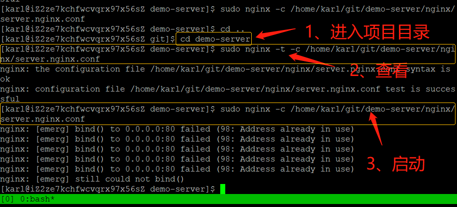

# 服务器部署教程

---

**部署前准备：**已购买**阿里云ECS服务器**和**域名**，电脑装了**Git**  
注：没有域名也可以用服务器公网ip地址访问(服务器是必须有的)

## 部署部分

> [1、putty](#putty)  
> [2、tmux](#tmux)  
> [3、用户](#用户)  
> [4、putty-配置无密码登录](#putty-配置无密码登录)  
> [5、防火墙](#防火墙)  
> [6、nginx](#nginx)  
> [7、阿里云创建项目](#阿里云创建项目)  
> [8、git](#git)  
> [9、mysql](#mysql)  

### putty

> [顶部](#部署部分)  

- 1、下载**putty** (本项目提供了putty安装包)
- 2、安装**putty**
- 3、为了方便使用建议把**putty**和**putty**目录下的**PuTTYgen**放到桌面
- 4、打开**putty**  

- 5、打开**ip地址连接**  

- 6、第一次打开ip连接会弹框，点击**是**，继续  

- 7、登录**服务器**，登录默认的root用户  


### tmux

> [顶部](#部署部分)  

- 1、**安装tmux：**`yum install tmux -y`  


- 2、创建一个**session(会话)**：`tmux`  


> tmux的其他操作：  
**恢复到上次启动的session：tmux a**  
**查看全部session：tmux ls**  
**删除指定session：tmux kill-session -t session (ID/名)**  
**横向分割窗口：Ctrl+b " 或 tmux split-window -h** (双引号要 用shift+引号键，'或'字后面是指令)  
**竖向分割窗口：Ctrl+b % 或 tmux split-window** (百分号要用shtift+5键，'或'字后面是指令)  
**移动到指定方向的窗口：Ctrl+b 方向键**  
**关闭当前窗口：Ctrl+d 或 exit** ('或'字后面是指令)  

### 用户

> [顶部](#部署部分)  

- 1、**添加**用户：`adduser username`，名字自定义，然后**修改**用户密码：`passwd username`  

- 2、**修改sudo权限：`visudo`，添加内容：`username ALL=(ALL) ALL`**  


> 用户的其他操作：  
**查看用户列表：ls -l /home/**  
**切换用户：su - username**  
**切换root用户：su -**  
**退出用户：exit**  
**删除用户：userdel -rf username**  

### putty 配置无密码登录

> [顶部](#部署部分)  

- 8、打开**PuTTYgen**，生成**公钥**和**私钥**保存到本地 (建议：**git的密钥**和服务器登录的**公钥**和**私钥**都丢在服务器项目目录下的**key**文件中，没有文件就创建一个)  


- 这里的文件名可以自定义，只要自己能分清是公钥还是私钥就行  
  
  
  
  

- 9、打开**putty**，**登录**用户  
  - **创建目录：`mkdir ~/.ssh`**  
  - **设置权限：`chmod 700 ~/.ssh`**  
  - **编辑密钥文件：`vi ~/.ssh/authorized_keys`**  

- 10、编辑**密钥文件**，粘贴**公钥**，**保存并退出**  


- 11、设置**密钥文件权限**  
  - **设置权限：`chmod 600 ~/.ssh/authorized_keys`**  

- 12、打开**putty**，**加载**服务器  

- 13、用户名建议输入默认的**root**，自定义的用户名是后面自己创建的 (注意：这里的名字必须是服务器上有的用户名)  


- 14、点击已保存的**ip**,然后点击**Save**，再点击**Open**  


- 15、输入指令：  
  - **执行`vi /etc/ssh/sshd_config`配置ssh**
  - **输入`/PasswordAuthentication`回车找到对应配置项**
  - **修改为`PasswordAuthentication no`拒绝使用密码登陆**
  - **执行`systemctl restart sshd.service`重启ssh服务生效**

- **注：新建的用户也有执行相同的操作：9-11的步骤**
- **！！！拒绝使用密码一旦开启，密钥文件若丢失，就再也无法登录服务器了(但是登录后可以改回密码登录权限) ！！！**

### 防火墙

> [顶部](#部署部分)  

- 1、**开启**防火墙、**重启**防火墙、添加**80/443/3306 (http/https/mysql)端口**和**http服务**，**重启**防火墙，**查看**是否添加成功
  - **开启防火墙：`systemctl enable firewalld.service`**
  - **重启防火墙：`systemctl restart firewalld.service`**
  - **查看防火墙信息：`firewall-cmd --list-all`**
  - **添加端口(80)：`firewall-cmd --permanent --zone=public --add-port=80/tcp`**
  - **添加服务(http)：`firewall-cmd --zone=public --add-service=http`**

- **注：两边的用户都要做一遍，新建的用户要输入管理员密码**

> 防火墙其他操作：  
**查看防火墙状态：systemctl status firewalld.service**  
**删除端口(80)：firewall-cmd --permanent --zone=public --remove-port=80/tcp**  
**删除服务(http)：firewall-cmd --permanent --zone=public --remove-service=http**  

### nginx

> [顶部](#部署部分)

- 1、**执行`vi /etc/yum.repos.d/nginx.repo`编辑nginx下载源，内容如下：**  

``` txt
[ginx-stable]  
name=nginx stable repo  
baseurl=http://nginx.org/packages/centos/$releasever/$basearch/  
gpgcheck=1  
enabled=1  
gpgkey=https://nginx.org/keys/nginx_signing.key  
```


- 2、**执行`yum install nginx -y`安装nginx**  
  - **执行`nginx -v`查看安装是否成功(会显示版本号)**  

- 3、**关闭**和**停用**服务
  - **关闭nginx服务开机启动指令：`systemctl disable nginx`**
  - **停止服务指令：`systemctl stop nginx`**  


> nginx其他操作：  
**配置nginx服务开机启动指令：systemctl enable nginx**  
**启动服务指令：systemctl start nginx**  
**配置文件默认位置：/etc/nginx/nginx.conf 和 /etc/nginx/conf.d/*.conf**  

### 阿里云创建项目

> [顶部](#部署部分)  

- 1、进入**code.aliyun.com**，**创建**一个public服务器项目  

- 2、**克隆**到本地  

- 3、**新建**三个文件：  
- (把git密钥，登录服务器的公钥和私钥放到项目的key文件夹下)  
- (建议：跟服务器有关的都提交到git，本项目提供了nginx文件)  

- 4、**编辑**server.nginx.conf配置文件 (另一个mime.types文件是固定的，不动)  

- 5、**新建**主页(index.html)，添加一点内容  

- 6、**推送并提交**项目  


### git

> [顶部](#部署部分)  

- 1、**下载**git，**查看版本**检查是否安装成功  
  - **执行`yum install git -y`安装git**  
  - **执行`git --version`查看git版本，测试git是否安装成功**  

- 2、配置**私有key**： (两个用户都要配置root和新建的) 
  - **执行`vi ~/.ssh/id_rsa`编辑私钥文件，将私钥复制进去**  
  - **执行`chmod 600 ~/.ssh/id_rsa`配置权限**  
  
  

- 3、在新创建的用户目录下**创建git文件**，**进入git文件**，**克隆项test项目到git文件下**，**查看**是否有**test文件**了  
  - **创建git文件：`mkdir git`**  
  - **进入git文件：`cd git`**  

- 4、打开**test中的nginx的配置文件**,**复制前两条指令**  
  -  **查看：`sudo nginx -t -c /home/karl/git/test/nginx/server.nginx.conf`**  
  - **启动：`sudo nginx -c /home/karl/git/demo-server/nginx/server.nginx.conf`**  
  - **关闭：`sudo nginx -s stop -c /home/karl/git/demo-server/nginx/server.nginx.conf`**  
  - **重置：`sudo nginx -s reload`**  

- 5、进入**test**文件中，**执行**复制的两行指令 (查看和启动)，启动时需输入用户密码

- 6、打开浏览器访问**域名**或**地址**  


- 注：每次在本地编辑上传项目文件后都要到git/test文件下拉取一次页面才会显示最新的样子，这样很麻烦！所以建议在tmux中再开一个新建用户的窗口，进入git/test文件中，执行指令：**`watch -n 600 git pull`** (单位：秒)，意思是：每隔十分钟拉取一次，且这个窗口不能关闭，关闭只后就不会自动拉取了！(关闭窗口：Ctrl+c)

### mysql

> [顶部](#部署部分)  

下载：`wget https://repo.mysql.com//mysql80-community-release-el8-1.noarch.rpm`  
安装源：`yum install mysql80-community-release-el8-1.noarch.rpm -y`  
查看安装配置文件：`vi /etc/yum.repos.d/mysql-community.repo`  
禁用mysql5：`dnf config-manager --disable mysql57-community` 或 `yum-config-manager --disable mysql57-community`  
启用mysql8：`dnf config-manager --enable mysql80-community` 或 `yum-config-manager --enable mysql80-community`  
关闭默认mysql：`yum module disable mysql -y`  
安装mysqlyum `yum install mysql-community-server -y`  
启用mysql服务：`systemctl enable mysqld`  
启动mysql服务：`systemctl start mysqld`  
查看mysql的默认root密码：`grep 'temporary password' /var/log/mysqld.log`  
启动命令行：`mysql -uroot -p`  
修改root默认密码，否则不能执行其它管理命令：`ALTER USER 'root'@'localhost' IDENTIFIED BY '新密码';`  
添加用户：`CREATE USER '用户名'@'%' IDENTIFIED BY '密码';`  
用户密码`IDENTIFIED WITH mysql_native_password`可以不使用加密密码  
用户授权：`GRANT ALL ON *.* TO '用户名'@'%' with grant option;`  
权限功能立即生效：`FLUSH PRIVILEGES;` 

> [顶部](#部署部分)  

---

- [**返回**](https://code.aliyun.com/kangxianghui/server/tree/master)