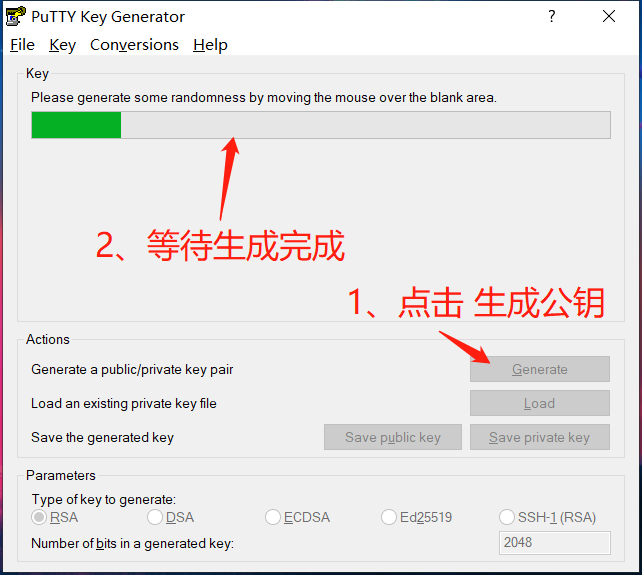

# 服务器部署教程

---

**部署前准备：**已购买**阿里云ECS服务器**和**域名**，电脑装了**Git**  
注：没有域名也可以用服务器公网ip地址访问(服务器是必须有的)

## 部署部分

### 1、putty

- 1、下载**putty**
- 2、安装**putty**
- 3、为了方便使用建议把**putty**和**putty**目录下的**PuTTYgen**放到桌面
- 4、打开**putty**  

- 5、打开**ip地址连接**  

- 6、第一次打开ip连接会弹框，点击**是**，继续  

- 7、登录**服务器**，登录默认的root用户  

### 2、tmux

- 1、**安装tmux：**`yum install tmux -y`  

- 2、创建一个**session(会话)**：`tmux`  

> tmux的其他操作：  
**恢复到上次启动的session：tmux a**  
**查看全部session：tmux ls**  
**删除指定session：tmux kill-session -t session (ID/名)**  
**横向分割窗口：Ctrl+b " 或 tmux split-window -h** (双引号要 用shift+引号键，'或'字后面是指令)  
**竖向分割窗口：Ctrl+b % 或 tmux split-window** (百分号要用shtift+5键，'或'字后面是指令)  
**移动到指定方向的窗口：Ctrl+b 方向键**  
**关闭当前窗口：Ctrl+d 或 exit** ('或'字后面是指令)  

### 3、用户

- 1、**添加**用户：`adduser username`，名字自定义，然后**修改**用户密码：`passwd username`  

- 2、**修改sudo权限：`visudo`，添加内容：`username ALL=(ALL) ALL`**  

> 用户的其他操作：  
**查看用户列表：ls -l /home/**  
**切换用户：su - username**  
**切换root用户：su -**  
**退出用户：exit**  
**删除用户：userdel -rf username**  

### 4、putty 配置无密码登录

- 8、打开**PuTTYgen**，生成**公钥**和**私钥**保存到本地 (建议：**git的密钥**和服务器登录的**公钥**和**私钥**都丢在服务器项目目录下的**key**文件中，没有文件就创建一个)  

- 这里的文件名可以自定义，只要自己能分清是公钥还是私钥就行  
  
  
  
  

- 9、打开**putty**，**登录**用户  
  - **创建目录：`mkdir ~/.ssh`**  
  - **设置权限：`chmod 700 ~/.ssh`**  
  - **编辑密钥文件：`vi ~/.ssh/authorized_keys`**  

- 10、编辑**密钥文件**，粘贴**公钥**，**保存并退出**  

- 11、设置**密钥文件权限**  
  - **设置权限：`chmod 600 ~/.ssh/authorized_keys`**  

- 12、打开**putty**，**加载**服务器  

- 13、用户名建议输入默认的**root**，自定义的用户名是后面自己创建的 (注意：这里的名字必须是服务器上有的用户名)  

- 14、点击已保存的**ip**,然后点击**Save**，再点击**Open**  

- 15、输入指令：  
  - **执行`vi /etc/ssh/sshd_config`配置ssh**
  - **输入`/PasswordAuthentication`回车找到对应配置项**
  - **修改为`PasswordAuthentication no`拒绝使用密码登陆**
  - **执行`systemctl restart sshd.service`重启ssh服务生效**

- **注：新建的用户也有执行相同的操作：9-11的步骤**

### 5、防火墙
- 1、**开启**防火墙、**重启**防火墙、添加**80/443/3306 (http/https/mysql)端口**和**http服务**，**重启**防火墙，**查看**是否添加成功
  - **开启防火墙：`systemctl enable firewalld.service`**
  - **重启防火墙：`systemctl restart firewalld.service`**
  - **查看防火墙信息：`firewall-cmd --list-all`**
  - **添加端口(80)：`firewall-cmd --permanent --zone=public --add-port=80/tcp`**
  - **添加服务(http)：`firewall-cmd --zone=public --add-service=http`**

- **注：两边的用户都要做一遍，新建的用户要输入管理员密码**

> 防火墙其他操作：  
**查看防火墙状态：systemctl status firewalld.service**  
**删除端口(80)：firewall-cmd --permanent --zone=public --remove-port=80/tcp**  
**删除服务(http)：firewall-cmd --permanent --zone=public --remove-service=http**  

### 6、nginx

- 1、

---

- [**返回**](https://code.aliyun.com/kangxianghui/server/tree/master)