# 服务器部署教程-Ubuntu篇

---

- [**返回**](https://github.com/karl1901/server/blob/master/README.MD)  

**部署前准备：** 已购买**云服务器**和**域名**，本地电脑安装了**Git**  
注：没有域名也可以用服务器公网ip地址访问(服务器是必须有的)，有域名了的就用自己的域名，并去域名管理控制台**申请SSL证书**  

---

## 部署目录

> [1、Putty](#putty)  
> [2、更新安装源](#更新安装源)  
> [3、tmux](#tmux)  
> [4、unzip](#unzip)  
> [5、用户](#用户)  
> [6、Putty配置无密码登录](#putty配置无密码登录)  
> [7、防火墙](#防火墙)  
> [8、Nginx](#nginx)  
> [9、Git](#git)  
> [10、MySQL](#mysql)  
> [11、JDK](#jdk)  
> [12、Tomcat](#tomcat)  
> [13、Redis](#redis)  
> [14、Node.js](#nodejs)  
> [15、Nacos](#nacos)  

---

### Putty

> [顶部](#部署目录)  

- 1、下载**putty** (本项目提供了putty安装包)  
- 2、安装**putty**  
- 3、为了方便使用建议把**putty**和**putty**目录下的**PuTTYgen**放到桌面  
- 4、打开**putty**  
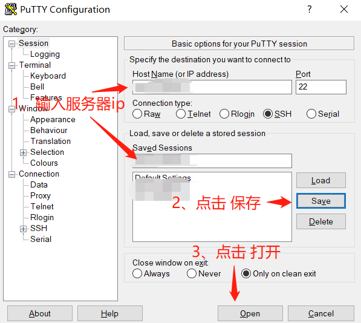  
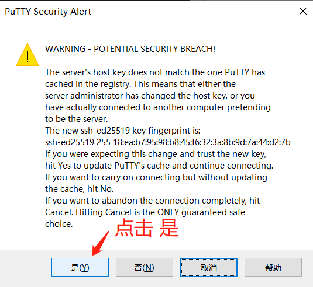  
- 5、输入重置后默认的用户名(例如：`ubuntu`)，然后输入重置时设置的密码，回车登录服务器；若登录成功，则服务器显示如下图：  
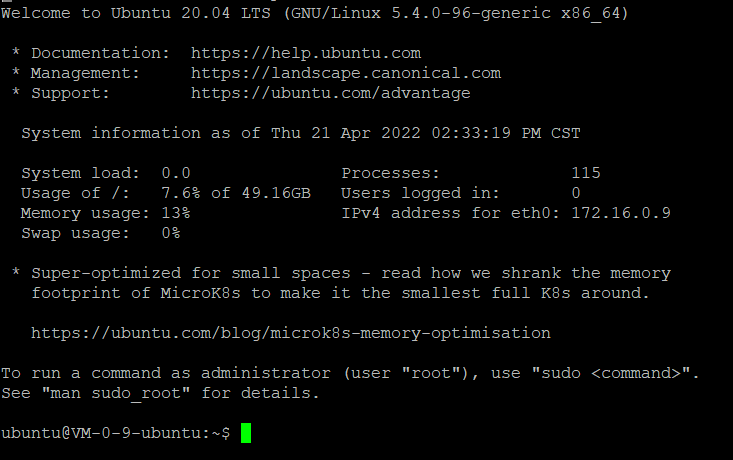  
- 注意：若是使用的腾讯云服务器，重置系统后重置的用户不是root用户，是新建的一个名为`ubuntu`用户；所以root用户的密码我们是不知道的，需要我们手动重置登录密码：  
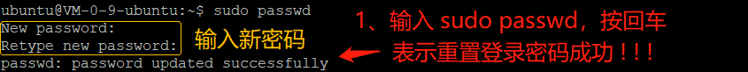  
- 重置登录密码完成后，就能使用`su -`登录到root用户了。  

### 更新安装源

> [顶部](#部署目录)  

- 1、**更新安装源指令：**`apt-get update`  

### tmux

> [顶部](#部署目录)  

- 1、**安装tmux：**`apt-get install tmux -y`  

### unzip

> [顶部](#部署目录)  

- 1、执行`apt-get install unzip -y`安装  

### 用户

> [顶部](#部署目录)  

- 1、**添加用户：**`adduser 用户名`  
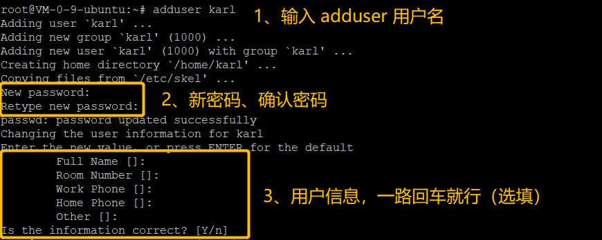  
2、**修改sudo权限：** 输入`visudo`进入配置文件编辑，然后添加内容：`用户名 ALL=(ALL) ALL`  

> 如希望用户sudo不输入密码则是：`用户名 ALL=(ALL:ALL) NOPASSWD:ALL`  

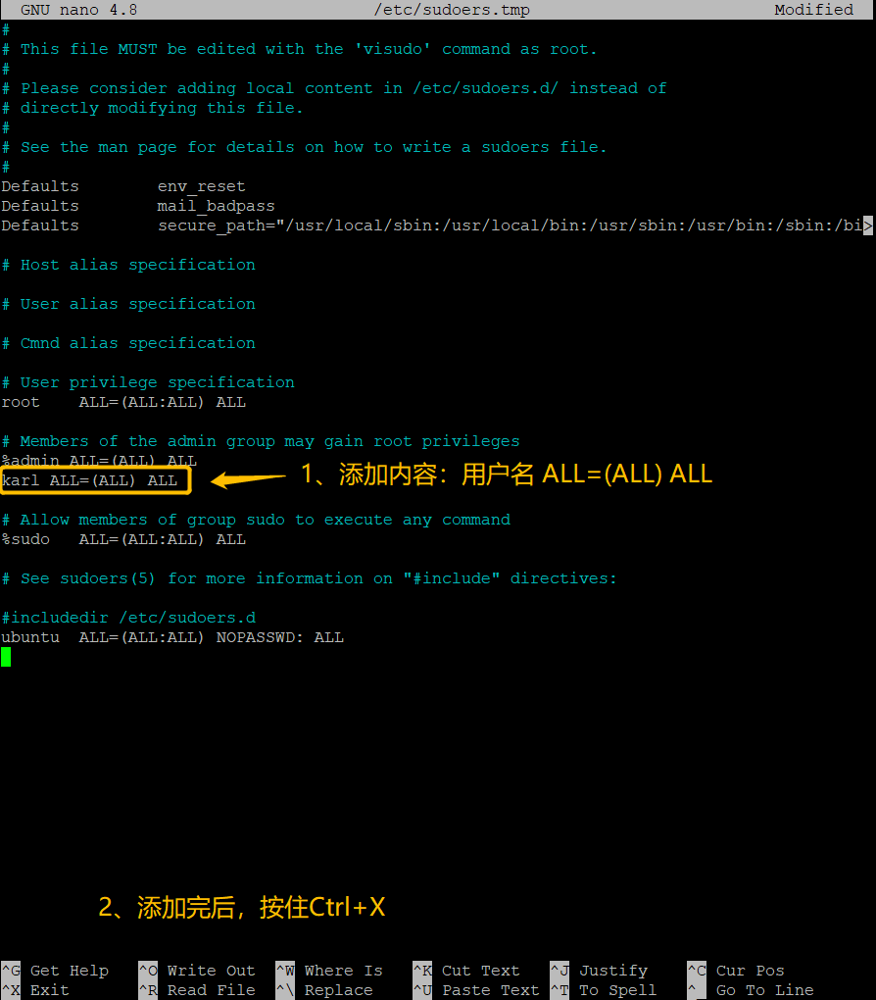  
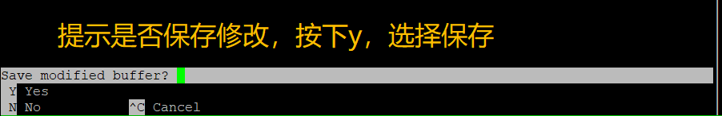  
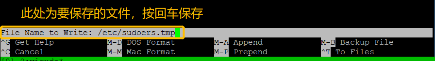  

> 用户的其他操作：  
**查看用户列表：ls -l /home/**  
**切换用户：su - username**  
**切换root用户：su -**  
**退出用户：exit**  
**删除用户：userdel -rf username**  

### Putty配置无密码登录

> [顶部](#部署目录)  

- 具体步骤详见**CentOS部署教程文档**的**putty配置无密码登录**部分。
  - 注意：如果报错不支持ssh-rsa，则需要手动添加支持ssh-rsa类型的公钥  
  - 执行`vi /etc/ssh/sshd_config`编辑sshd配置文件  
  - 在合适的位置添加一行内容：  

```txt
PubkeyAcceptedKeyTypes=+ssh-rsa
```

- 若不想新建用户，只用root，ssh配置如下：

```txt
PermitRootLogin prohibit-password
PasswordAuthentication no
PubkeyAuthentication yes
```

- 执行`systemctl restart sshd.service`重启sshd服务生效  
- 配置无密码登录：  
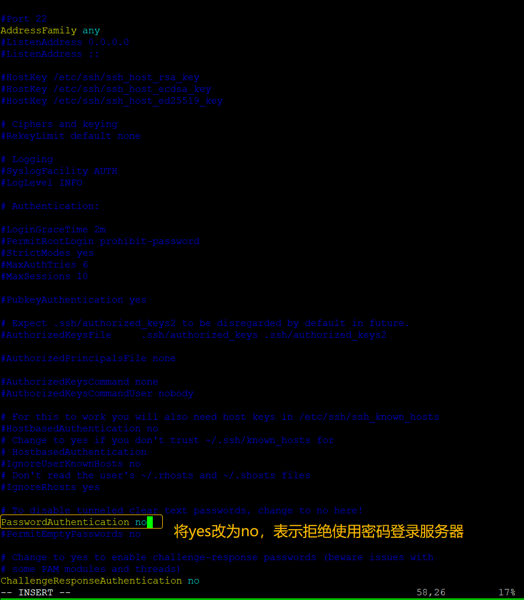  
- **注：新建的用户也有执行相同的操作**  
- **注意：拒绝使用密码一旦开启，密钥文件若丢失，就再也无法登录服务器了(但是登录后可以改回密码登录权限)**  

### 防火墙

> [顶部](#部署目录)  

- 1、**下载防火墙：**`apt install ufw -y`  
- 2、**查看防护墙状态：**`ufw status`  
  - `Status: inactive`--表示关闭中  
  - `Status: active`--表示运行中  
- 3、**启用防火墙：**`ufw enable`  
- 4、**添加端口/协议：**  
  - http：`ufw allow 80/tcp` || `ufw allow http`  
  - https：`ufw allow 443/tcp` || `ufw allow https`  
  - ssh端口：`ufw allow 22/tcp` || `ufw allow ssh`  
  - mysql端口：`ufw allow 3306/tcp`  
  - redis端口：`ufw allow 6379/tcp`  
  - tomcat端口：`ufw allow 8080/tcp`  
  - nacos端口：`ufw allow 8848/tcp`  
  - 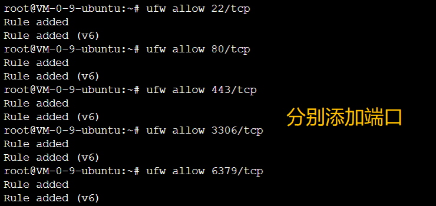  
- 5、**查看防火墙规则编号：**`ufw status numbered`  
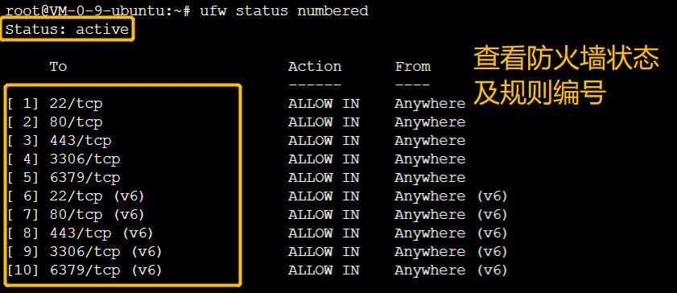  
- **注：新建的用户也做一遍！！！**  

> 防火墙其他操作：  
> **禁用防火墙：**`ufw disable`  
> **删除对应编号的规则：**`ufw delete 编号`  
> 例如：`ufw delete 1`  
> **删除防火墙规则：**`ufw delete allow 规则名称`  
> 例如：`ufw delete allow 80/tcp`  

### Nginx

> [顶部](#部署目录)  

- 1、**安装nginx：**`apt install nginx -y`  
- 2、执行`nginx -v`查看安装是否成功，安装成功就会显示版本号
- 3、**关闭nginx服务开机启动：**`systemctl disable nginx`  
- 4、**停止服务：**`systemctl stop nginx`  

> 其他指令：  
> **配置nginx服务开机启动：**`systemctl enable nginx`  
> **启动服务：**`systemctl start nginx`  
> **配置文件默认位置：**`/etc/nginx/nginx.conf`和`/etc/nginx/conf.d/*.conf`  

### Git

> [顶部](#部署目录)  

- 1、**安装Git：**`apt install git -y`  
- 2、**安装完成后查看版本：**`git --version`  
- 3、**配置私钥：**  
  - 注意：如果报错不支持ssh-rsa，则需要手动添加支持ssh-rsa类型的公钥  
  - 执行`vi /etc/ssh/ssh_config`编辑ssh配置文件  
  - 在合适的位置添加如下内容：  

```txt
HostkeyAlgorithms +ssh-rsa
PubkeyAcceptedKeyTypes +ssh-rsa
```

  - 执行`systemctl restart ssh.service`重启ssh服务生效  
  - (1)、执行`vi ~/.ssh/id_rsa`编辑私钥文件，将私钥(**本地的id_rsa文件内容**)复制进去，然后保存并退出  
  - (2)、执行`chmod 600 ~/.ssh/id_rsa`配置私钥文件权限  
- 4、**创建git项目文件夹：**`mkdir git`  
- 5、**进入git目录下：**`cd git`  
- 6、**克隆项目：**`git clone 项目git地址`  
  - 过程中有提示就输入：`yes`，然后回车  
- 7、**修改nginx.conf配置文件顶部几条指令的地址：**  
  - (1)、进入服务器项目目录的nginx配置文件的目录下，输入：**pwd**查看完整的服务器路径，然后复制，粘贴修改项目的nginx.conf配置文件顶部的路径  
  - (2)、提交项目，推送到git  
  - (3)、进入服务器git项目目录下，输入`git pull`拉取项目  
- 8、**指定nginx配置文件：**`sudo nginx -t -c 服务器nginx.conf配置文件地址`(就是nginx.conf配置文件顶部的第一条指令)  
- 9、**启动nginx服务：**`sudo nginx -c 服务器nginx.conf配置文件地址`(就是nginx.conf配置文件顶部的第一条指令)  
- 现在能通过浏览器访问项目网页了！！！  
- 10、**配置git项目自动拉取：**，切割一个新窗口，输入`watch -n 执行间隔时间(单位：秒/s) git pull`(建议：10分钟~30分钟)  

### MySQL

> [顶部](#部署目录)  

- 1、**下载安装源：**`curl -OL 安装源地址`(更新地址可以去[MySQL官方](https://downloads.mysql.com/archives/community/)找，我用的是：`curl -OL https://repo.mysql.com//mysql-apt-config_0.8.22-1_all.deb`)  
- 2、**更新安装配置：**`sudo dpkg -i 更新地址后面的完整文件名`(例如：`sudo dpkg -i mysql-apt-config_0.8.22-1_all.deb`)  
  - 选择mysql8  
  - 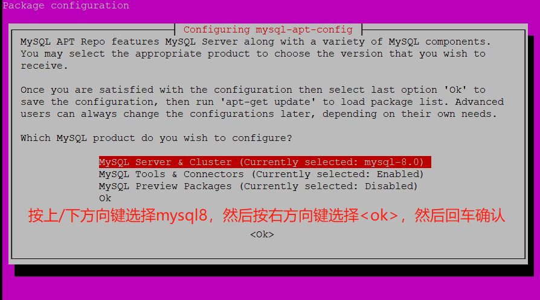  
  - 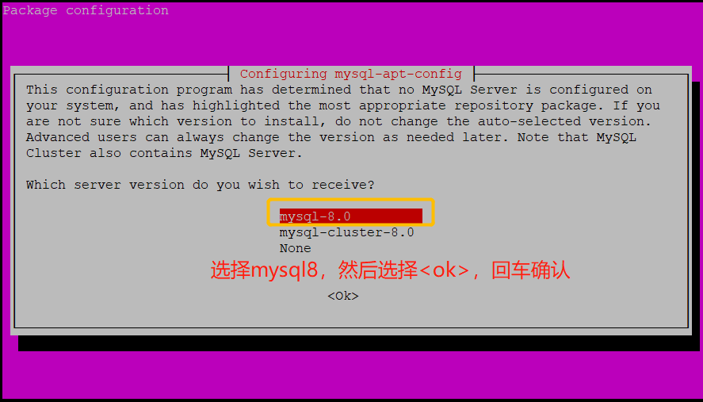  
  - 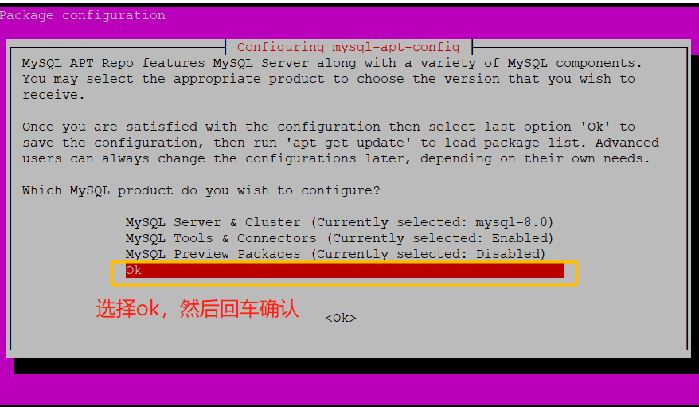  
- 3、**更新安装源：**`apt update`(普通用户：`sudo apt update`)  
- 4、**安装MySQL：**`apt install mysql-server -y`(普通用户：`sudo apt install mysql-server -y`)  
  - 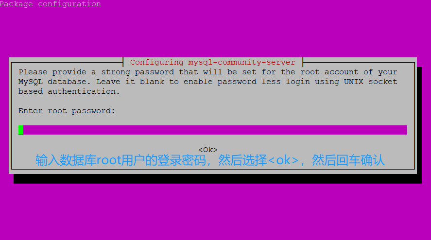  
  - 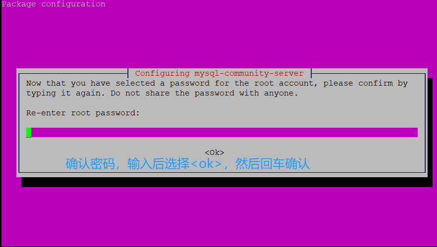  
  - 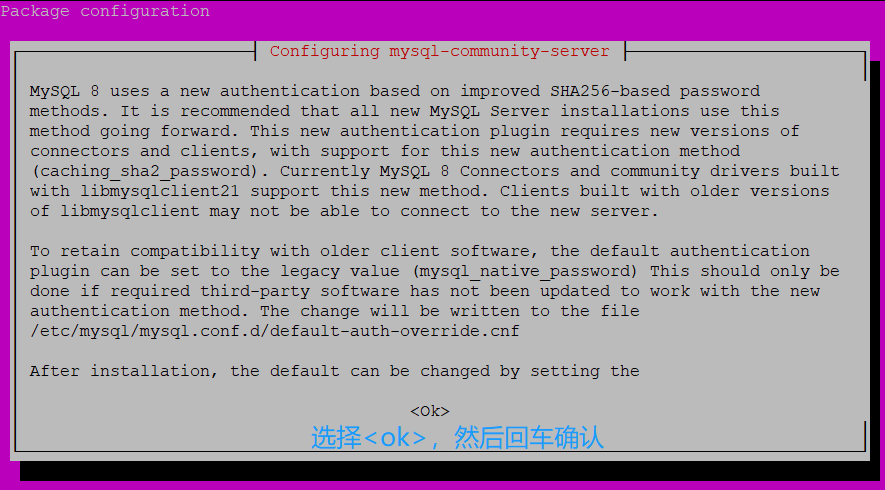  
  - 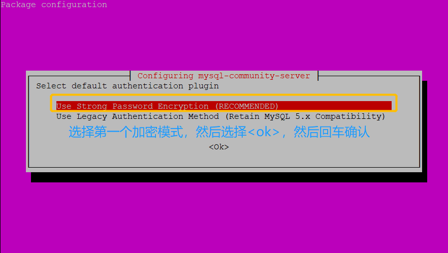  
- 5、**启动MySQL：**`mysql -uroot -p`  
- 6、**输入root用户的密码，然后登入数据库**  
- 7、**添加数据库用户：**`CREATE USER '用户名'@'%' IDENTIFIED BY '密码';`  
- 8、**设置用户权限：**`GRANT ALL ON *.* TO '用户名'@'%' with grant option;`  
- 9、**权限功能立即生效：**`FLUSH PRIVILEGES;`  
- 注意：如果远程连接失败，报错10061错误；请检查用户权限是否为%、防火墙是否开放了3306端口、服务器安全组  
- 如果以上都是正确的，可以修改mysql配置文件来解决：  
- (1)、执行`sudo nano /etc/mysql/mysql.conf.d/mysqld.cnf`打开配置文件  
- (2)、将bind - address 的默认值(127.0.0.1) 修改成 `远程连接的ip`(推荐，更安全)或`*`  

#### 22.04版本

- **1、安装MySQL：**`apt-get install mysql-server -y`(普通用户：`sudo apt-get install mysql-server -y`)  
- **2、检查MySQL服务是否成功启动：**`netstat -tap | grep mysql`(普通用户：`sudo netstat -tap | grep mysql`) **或者：**`service mysql status`(普通用户：`sudo service mysql status`)  
  - **如果未启动，就启动服务：**`service mysql start`(普通用户：`sudo service mysql start`)  
  - 启动服务如果遇到警告(su:warning blah blah blah...)：  
    - **1、停止服务：**`service mysql stop`(普通用户：`sudo service mysql stop`)  
    - **2、为mysql用户创建一个主目录：**`usermod -d /var/lib/mysql/ mysql`(普通用户：`sudo usermod -d /var/lib/mysql/ mysql`)  
    - **3、启动服务：**`service mysql start`(普通用户：`sudo service mysql start`)  
- **3、本地连接MySQL：**  
  - **1、下载连接客户端(一般安装时都会自动安装客户端)：**`apt install mysql-client -y`(普通用户：`sudo apt install mysql-client -y`)  
  - **2、登录MySQL(无需密码)：**`mysql -uroot -p`(普通用户：`sudo mysql -uroot -p`)  
  - 如果安装时没有设置密码，并且登录不了MySQL，需要按照如下步骤操作：  
    - **1、查看默认的用户名和密码：**`cat /etc/mysql/debian.cnf`(普通用户：`sudo cat /etc/mysql/debian.cnf`)  
    - **2、用户查到的用户名和密码登录：**`mysql -u xxx -p xxx`(普通用：`sudo mysql -u xxx -p xxx`)  
    - **3、设置root用户的密码：**  
      - `use mysql;`  
      - `flush privileges;`  
      - `ALTER USER 'root'@'localhost' IDENTIFIED WITH mysql_native_password BY '你的密码';`  
      - `flush privileges;`  
- **4、远程连接MySQL(需使用默认账户操作)：**  
  - **1、切换到mysql数据库：**`use mysql;`  
  - **2、查看user列表：**`select user,host from user;`  
  - **3、创建用户：**`CREATE USER '用户名'@'%' IDENTIFIED BY '密码';`  
  - **4、设置用户权限：**`GRANT ALL ON *.* TO '用户名'@'%' with grant option;`  
  - **5、权限功能立即生效：**`FLUSH PRIVILEGES;`  
  - 如果远程连接失败，非密码错误原因，可以尝试以下操作：  
  - 1、直接修改用户权限：`update user set host='%' where user='用户名';`  
  - 2、如果上述操作不行，需要修改配置文件：
    - 1、打开配置文件：`nano /etc/mysql/mysql.conf.d/mysqld.cnf`(普通用户：`sudo nano /etc/mysql/mysql.conf.d/mysqld.cnf`)  
    - 2、将bind - address 的默认值(127.0.0.1) 修改成 `远程连接的ip`(推荐，更安全)或`*`  
    - 3、保存并退出  
    - 4、重启服务：`service mysql restart`(普通用户：`sudo service mysql restart`)  

> MySQL的其他操作：  
彻底卸载MySQL：
1、**将包以及软件的配置文件全部删除：**`apt purge mysql-*`(普通用户：`sudo apt purge mysql-*`)  
2、`rm -rf /etc/mysql/ /var/lib/mysql`(普通用户：`sudo rm -rf /etc/mysql/ /var/lib/mysql`)  
3、`apt autoremove`(普通用户：`sudo apt autoremove`)  
4、`apt autoclean`(普通用户：`sudo apt autoclean`)  

### JDK

> [顶部](#部署目录)  

- 1、**查找JDK信息：**`apt-cache search openjdk`(这里是查找的openjdk信息)  
- 2、**安装JDK：**`apt install openjdk-8-jdk -y`(这里安装的openjdk8，普通用户：`sudo apt install openjdk-8-jdk -y`)  
- 3、**安装完成后，查看JDK版本：**`java -version`  
- 其他指令：
  - **卸载OpenJDK：**`apt-get remove openjdk*`(普通用户：`sudo apt-get remove openjdk*`)

### Tomcat

> [顶部](#部署目录)  

- 1、**安装Tomcat：**`curl -OL Tomcat的下载地址`(我这里安装的是Tomcat8：`curl -OL https://dlcdn.apache.org/tomcat/tomcat-8/v8.5.78/bin/apache-tomcat-8.5.78.tar.gz`，地址可以去[Tomcat官方](https://tomcat.apache.org/)找)  
- 2、**解压Tomcat文件：**`tar -zxvf 文件名`(例如：`tar -zxvf apache-tomcat-8.5.78.tar.gz`)  
  - (1)、给定tomcat目录权限：`chmod -R 777 目录名`  
- 3、**进入Tomcat解压文件夹的`/conf/`目录下**  
- 4、**编辑server.xml文件：**`vi server.xml`  
- 5、**查找`appBase`：**`/appBase`，输入后按回车定位  
- 6、**将`appBase="webapps"`** 改成 **`appBase="项目的后端接口文件目录"`**  
- 7、**进入Tomcat解压文件夹的`/bin/`目录下**  
- 8、**启动Tomcat：**`./startup.sh`  
- 现在就能通过浏览器访问`接口/接口文档`了！！！  

### Redis

> [顶部](#部署目录)  

- 1、**安装Redis：**`apt install redis-server -y`(普通用户：`sudo apt install redis-server -y`)  
- 2、**修改redis配置：**`vi /etc/redis/redis.conf`  
  - (1)、修改密码查找：`requirepass`  
  - (2)、修改ip绑定查找：`bind`  
  - (3)、修改端口查找：`port`  

### Node.js

> [顶部](#部署目录)  

- 1、**NodeSource安装源：**`curl -fsSL https://deb.nodesource.com/setup_16.x | sudo -E bash -`  
- 2、**安装Node.js：**`apt-get install -y nodejs`  
- 3、**查看Node.js版本：**`node -v`  
- 4、**查看npm版本：**`npm -v`  

### Nacos

> [顶部](#部署目录)  

- 1、**下载Nacos压缩包：**`curl -OL Nacos的下载地址`(下载地址在[官方github](https://github.com/alibaba/nacos/releases)上面，Linux下载.tar.gz的压缩包)  
- 2、**解压Nacos的压缩包：**`tar -zxvf Nacos的压缩包名`  
- 3、**配置Nacos：**  
  - (1)、**在数据库创建名为`nacos_config`的数据库**  
  - (2)、**进入Nacos的`conf/`目录下**  
  - (3)、**运行`nacos-mysql.sql`文件，运行完成后`nacos_config`数据库中就有了Nacos系统默认的表(12张表-nacos-2.1.0版本)**  
  - (4)、**编辑`application.properties`文件：**  
  - 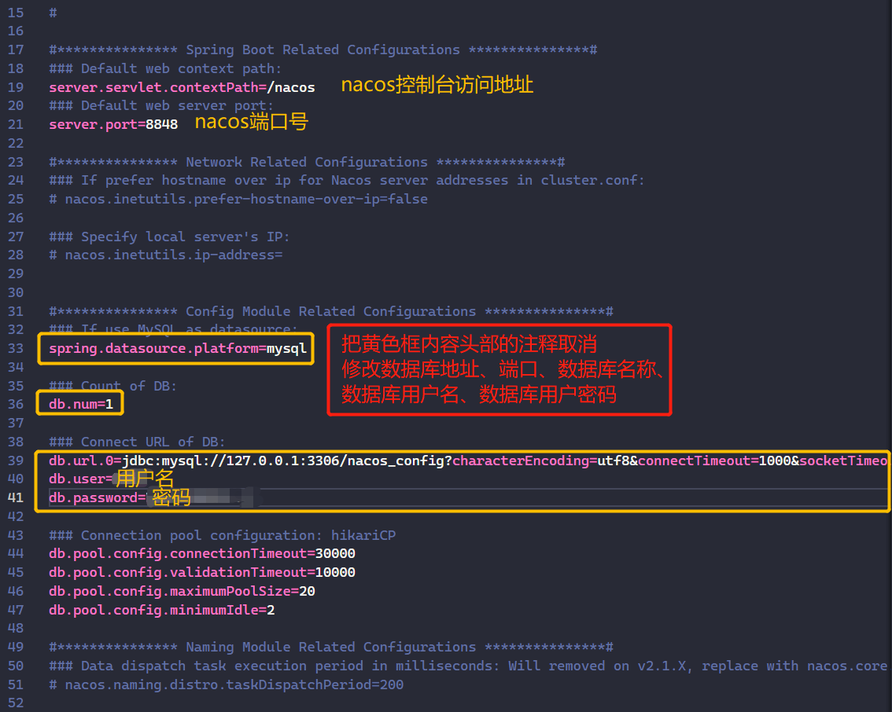  
  - (5)、**修改完后，保存并退出**  
- 4、**添加Nacos的防火墙（根据端口号-默认8848）**  
- 5、**启动Nacos：**  
  - (1)、**进入Nacos的`bin/`目录下**  
  - (2)、**输入`bash startup.sh -m standalone`，以单机模式启动**  
    - `standalone`--单机模式  
    - `cluster`--集群模式(默认)  
- 6、**配置Nginx**  
- 7、**访问Nacos系统**  

---

- [**返回**](https://github.com/karl1901/server/blob/master/README.MD)  
