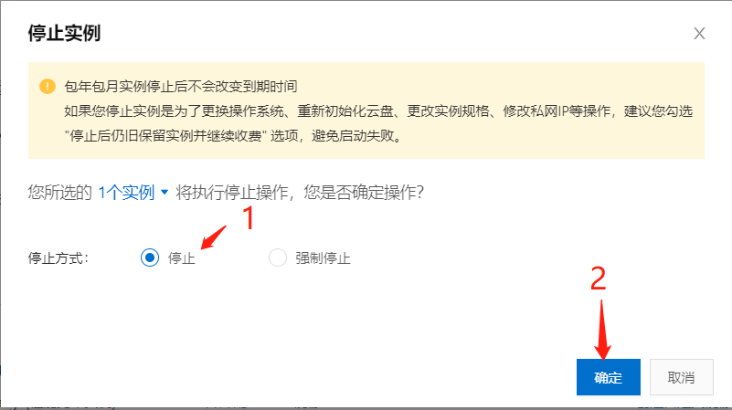
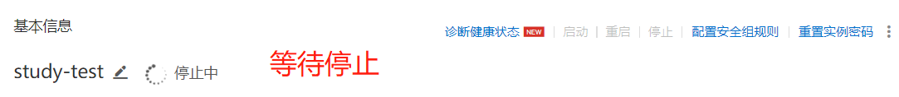
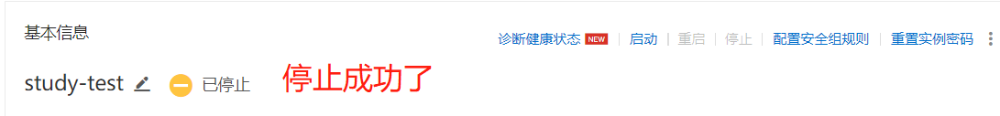
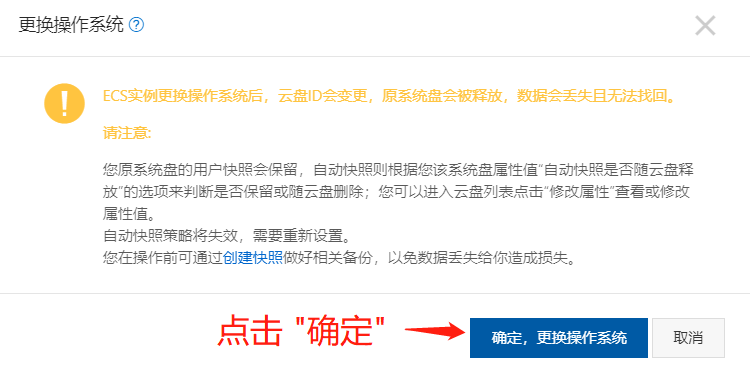
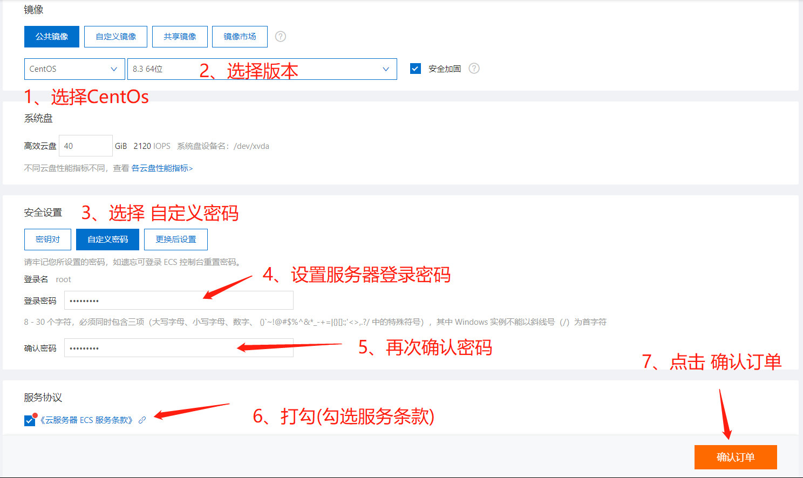
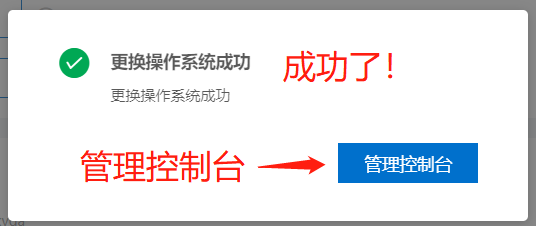

# 阿里云ECS服务器重置

---

- 1、**打开**阿里云官网(aliyun.com)
- 2、**登录**阿里云账号
- 3、点击**控制台**
- 3、进入**云服务器ecs管理**
- 4、点击进入**实例管理**界面
- 5、点击**停止服务器**  

- 6、选择**停止**，然后点击**确定**  

- 7、**等待**服务器停止  

- 8、显示**已停止**，表示停止**成功**  

- 9、点击**更换操作系统**  

- 10、点击**确定，更换操作系统**  

- 11、按图所示，选择好后点击**确认订单**  

- 12、出现如图提示，表示重置服务器成功了，就可以进入管理实例了  

> [顶部](#阿里云ecs服务器重置)  

---

- [**返回**](https://code.aliyun.com/kangxianghui/server/tree/master)