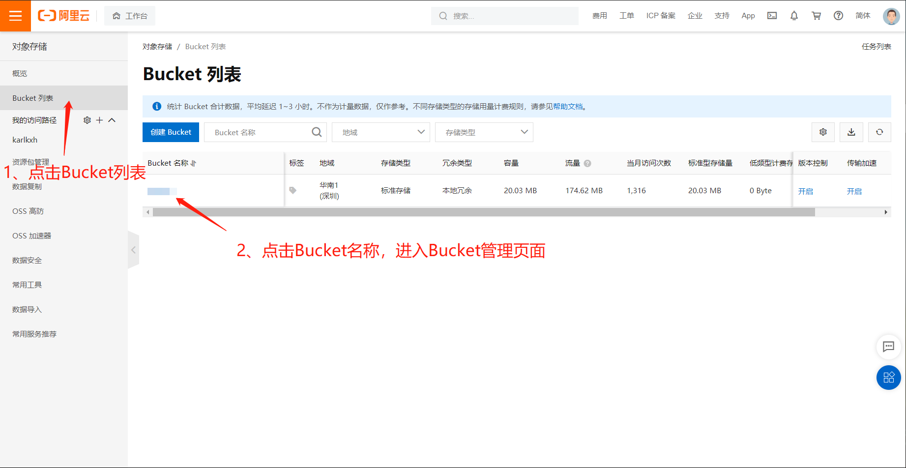

# OSS对象存储购买与配置教程

---

- [**返回**](https://code.aliyun.com/kangxianghui/server/tree/master/README.MD)  

## OSS对象存储购买教程

### 1、购买

  

注：购买后需要开通oss服务才能进入控制台管理OSS  

### 2、配置

- 1、创建AccessKey
  
  
  
注：AccessKey创建后就能获取**AccessKey ID**和**AccessKey Secret**  

- 2、创建Bucket
  
  
  
注：Bucket创建后就能获取**Endpoint**和**Bucket名称**  
- 3、配置Bucket权限
  
  
  
  
**至此，OSS基本配置已完成**  

### 3、管理OSS

所有配置完成后，可进入[胡辉煜的oss管理程序](https://huhuiyu.top/oss-manage-ui/)管理OSS  
  
注：所有配置参数在上述的配置教程中都能找到 ！！！  

---

- [**返回**](https://code.aliyun.com/kangxianghui/server/tree/master/README.MD)  
