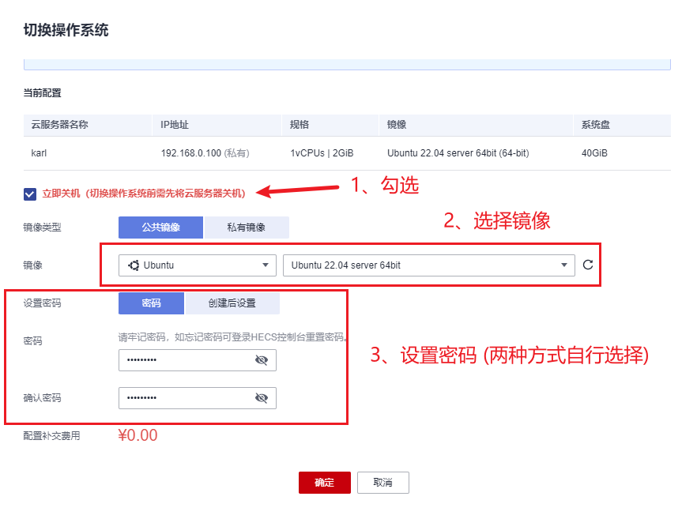
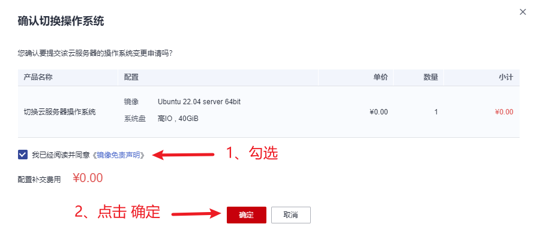

# 华为云服务器重置

---

- [**返回**](https://github.com/karl1901/server/blob/master/README.MD)  

- 1、**打开**[华为云官网](https://www.huaweicloud.com/)  
- 2、**登录**华为云账号  
- 3、点击**控制台**  
- 4、进入**云服务器管理**  
- 5、**选择节点**，控制台会列出当前节点的云服务器  
- 6、点击**切换操作系统**  
  
- 7、**选择镜像、并设置密码**  
  
- 8、点击**确定**开始重装镜像  
- 9、确认操作  
  
- 10、等待系统重装完成  

> [顶部](#华为云服务器重置)  

---

- [**返回**](https://github.com/karl1901/server/blob/master/README.MD)  
