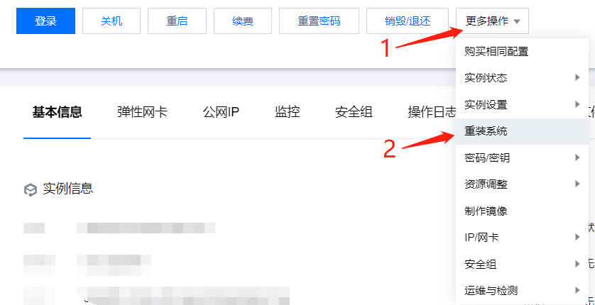
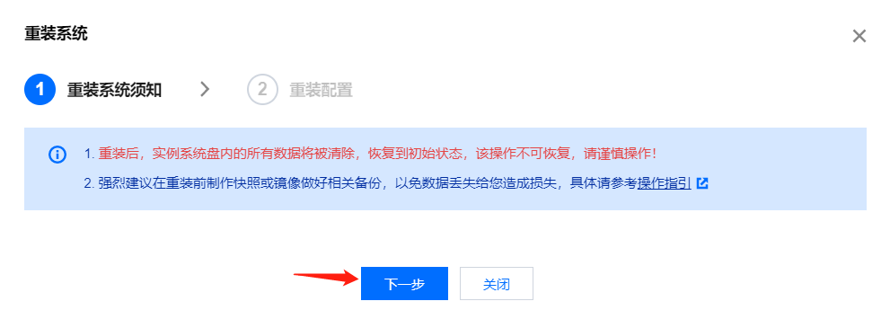
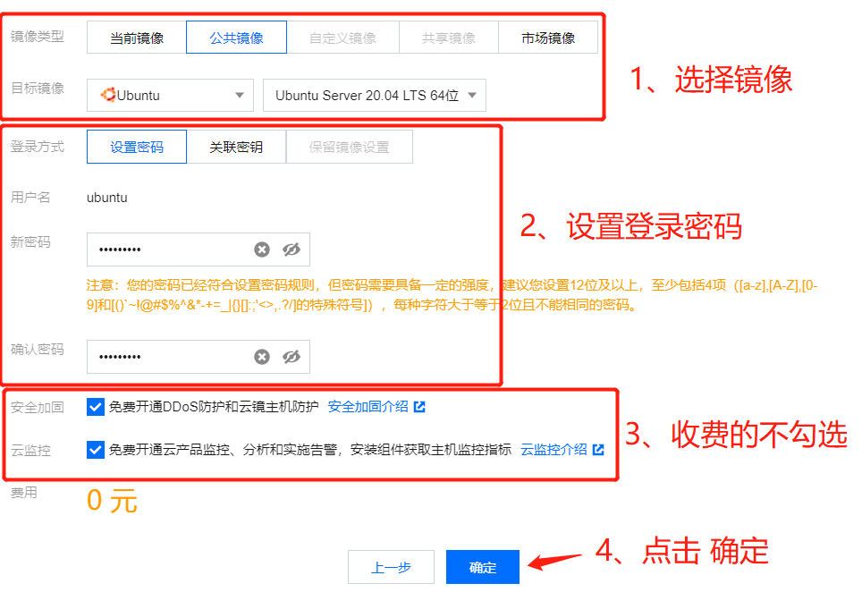
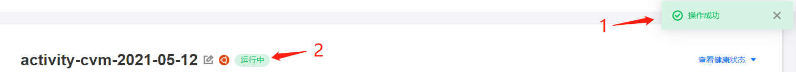

# 腾讯云服务器重置

---

- [**返回**](https://code.aliyun.com/kangxianghui/server/tree/master/README.MD)  

- 1、**打开**[腾讯云官网](https://cloud.tencent.com/)  
- 2、**登录**腾讯云账号  
- 3、点击**控制台**  
- 4、进入**云服务器管理**  
- 5、点击进入**实例**管理界面  
- 6、点击**实例名称**进入实例管理界面  
- 7、点击**关机**，先将服务器停止  
- 8、点击**更多操作** >> **重装系统**  
  
- 9、点击**下一步**  
  
- 10、重装配置  
  
- 11、控制台显示**操作成功**字样后，等待服务器启动并显示**运行中**，就表示重置成功了。  
  

> [顶部](#腾讯云服务器重置)  

---

- [**返回**](https://code.aliyun.com/kangxianghui/server/tree/master/README.MD)  
